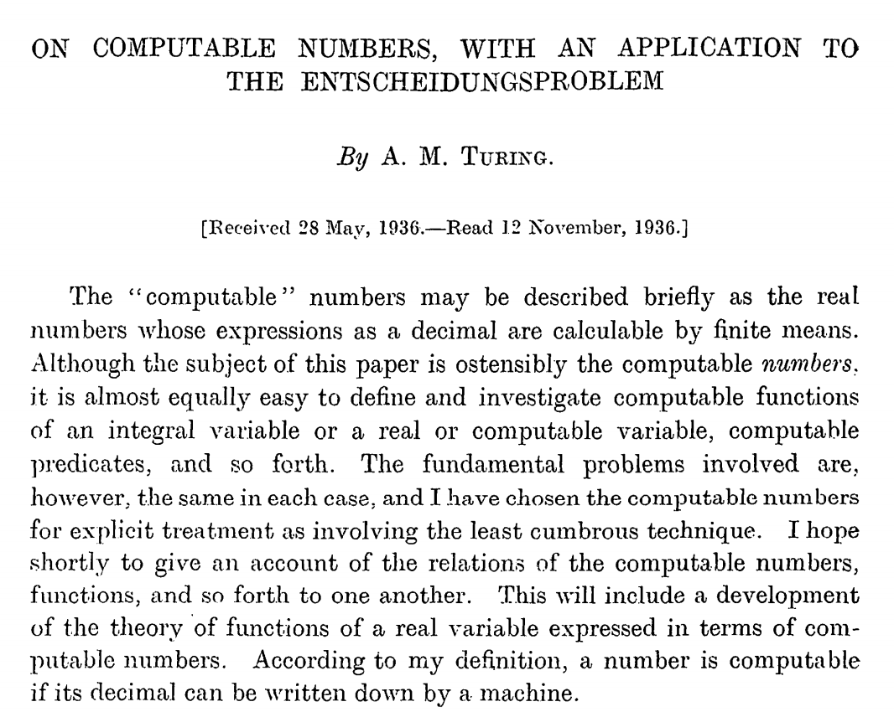

# Seminal Papers in Computer Science
A Catalogue of Seminal Papers in Computer Science

# 1930s

# [On computable numbers with an application to the Entscheidungsproblem](https://web.archive.org/web/20191015224642/https://www.cs.virginia.edu/~robins/Turing_Paper_1936.pdf)
## Alan Turing (1936)
### 36 pages

In this paper, Alan Turing presents his proof for the assertion that some decision problems are undecidable: That there is no effective procedure that infallibly can give a correct yes/no answer to a well described problem. Lead to the idea of Turing Machine and resulted in Church-Turing Thesis (Showed that computational power of Turing machines is equivalent to that of 𝜆-definable functions).
