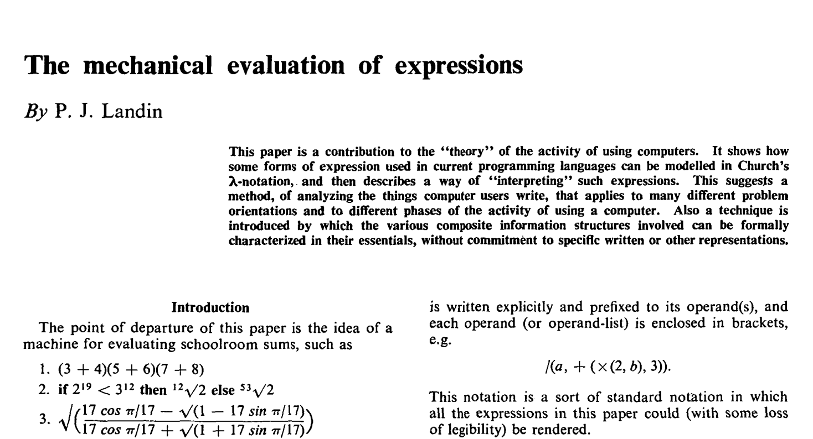

# Seminal Papers in Computer Science
A Catalogue of Seminal Papers in Computer Science

# 1930s

# A Set of Postulates for the Foundation of Logic ([I](https://www.jstor.org/stable/1968337), [II](https://www.jstor.org/stable/1968702?seq=1#page_scan_tab_contents))
## Alonzo Church (1932,1933)
### 20 pages

Initial papers in which Alonzo Church introduces Lambda Calculus.

# [On computable numbers with an application to the Entscheidungsproblem](https://web.archive.org/web/20191015224642/https://www.cs.virginia.edu/~robins/Turing_Paper_1936.pdf)
## Alan Turing (1936)
### 36 pages

In this paper, Alan Turing presents his proof for the assertion that some decision problems are undecidable: That there is no effective procedure that infallibly can give a correct yes/no answer to a well described problem. Lead to the idea of Turing Machine and resulted in Church-Turing Thesis (Showed that computational power of Turing machines is equivalent to that of 𝜆-definable functions).

# 1960s

# [The Mechanical Evaluation of Expressions](https://web.archive.org/web/20161126162517/https://www.cs.cmu.edu/~crary/819-f09/Landin64.pdf)

One of the paper's that gave birth to denotational semantics (the method of analyzing programming constructs with the help of Lambda Calculus)

